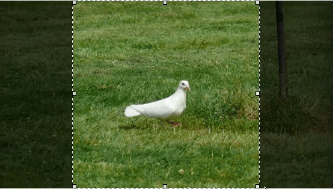

# CropSelectJs

A simple image cropping selection jQuery plugin.

[View working example >](https://zara4.com/projects/crop-select-js)





By [Zara 4 image compression](https://zara4.com) service


# Installation

- Bower: `bower install crop-select-js --save`
- NPM: `npm install crop-select-js`
- Zip: [Download](https://github.com/zara-4/crop-select-js/archive/master.zip)

You will need to include both `crop-select-js.min.js` and `crop-select-js.min.css` into your web page.


# Basic Example

Html code
```html
<div id='crop-select'></div>
```

Javascript code
```javascript
$('#crop-select').CropSelectJs({
  imageSrc: 'path/to/image.jpg'
});
```


# Functions

To call a function on a CropSelectJs element, follow the pattern below.
Replace the text 'function' with the name of the function you wish to call.

```javascript
$('#crop-select').CropSelectJs('function')
```

The functions available are listed below:

| Function                       | Description                                                                 |
| :----------------------------- | :-------------------------------------------------------------------------- |
| enableAnimatedBorder           | Make the selection border animated                                          |
| disableAnimatedBorder          | Make the selection border static (not animated)                             |
| getSelectionBoxX               | Get the X coordinate of the selection box                                   |
| setSelectionBoxX               | Set the X coordinate of the selection box                                   |
| getSelectionBoxY               | Get the Y coordinate of the selection box                                   |
| setSelectionBoxY               | Set the Y coordinate of the selection box                                   |
| getSelectionBoxWidth           | Get the width of the selection box                                          |
| setSelectionBoxWidth           | Set the width of the selection box                                          |
| getSelectionBoxHeight          | Get the height of the selection box                                         |
| setSelectionBoxHeight          | Set the height of the selection box                                         |
| setSelectionAspectRatio        | Set the aspect ratio of the selection box                                   |
| clearSelectionAspectRatio      | Clear the aspect ratio of the selection box (allows free resizing)          |
| getImageSrc                    | Get the src to the current image being displayed                            |
| getImageWidth                  | Get the width of the current image being displayed                          |
| getImageHeight                 | Get the height of the current image being display                           |
| getImageAspectRatio            | Get the aspect ratio of the current image being displayed                   |
| setImageSrc                    | Set the src of the image to be displayed                                    |
| selectEverything               | Select the entire image                                                     |
| selectCentredSquare            | Select a square centred in the middle of the image                          |
| selectCentredFittedAspectRatio | Select an area matching the aspect ratio centred in the middle of the image |


# License

CropSelectJs is released under the GNU GPL 3.0 license. [View license](LICENSE.md)